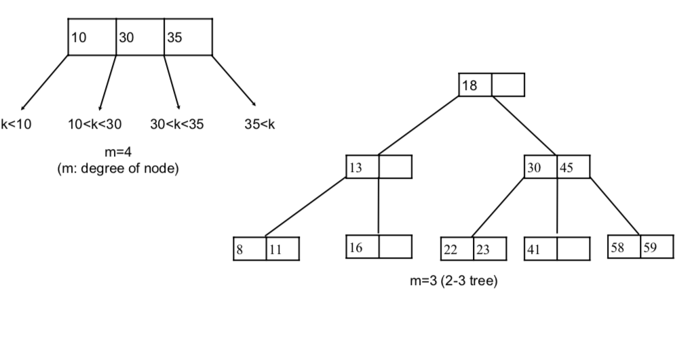

### B Tree
---

#### 1. m-way search tree

Disk access is much slower than memory access. and disk is partitioned into blocks (pages) and the access time of a word is the same as that of the entire block containing the word.

so, **binary trees are not quite appropriate for data stored on disks**

we need **to reduce the number of disk access**
→ make each node of the tree wider 

#### 2. B-tree

##### :  B-트리는  자료를  정렬된  상태로  보관하고, 삽입  및  삭제를 대수  시간에  할  수  있는 자료구조로, 데이터베이스와 파일  시스템에서  널리  사용된다. 

##### 1. definition
a B-tree of order m is an m-way search tree with the following properties 
- the root is either a leaf or has at least 2 children  
- all non-leaf nodes (except the root) have between ⎡m/2⎤ and m children 
- all leaves are at the same level

for example,  

- when m=2, full binary tree
- when m=3, all internal nodes of B-tree have a degree of either 2 or 3 (2-3tree)  
- when m=4, all internal nodes of B-tree have a degree of 2, 3, or 4 (2-3-4
tree)  

##### 2. usage
- number of disk access is O(log_m N)  
- each disk access requires O(log m) overhead to determine the direction to branch, but this is done in main memory without a hard disk access, thus negligible.
- m can be determined as large as possible, but it must still be small enough so that an internal node can fit into one disk block.
- m is typically between 32 and 256.  
- often one or two levels of internal nodes reside in main memory.

----
Ref

[B Tree.pdf](https://github.com/janghoikoo/blog/blob/master/data-structure/btree/btree.pdf)

