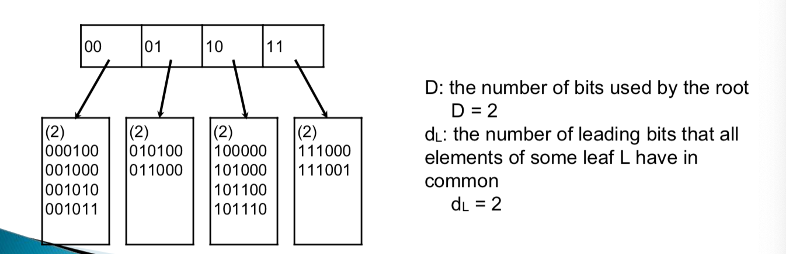

### Hasing
##### : technique used for performing insertion, deletion, and finding in constant time
---


#### 1. ADT

- Collection of pairs
	- pair : (key, element)
	- each pair have unique key
	
- Operations
	- search(key)
	- delete(key)
	- insert(key, element)

#### 2. Static hasing

- hash table is an array of fixed size, containing the keys 
- hash function maps each key to some cell in the hash table


#### 3. Resolving Collision
##### collision : occurs when different keys are mapped to the same cell

##### 1. separate chaining (open hasing)

- keep a list of all elements that hash to the same value
- needs extra space and operation for pointers and new nodes


##### 2. open addressing (closed hasing)
- if a collision occurs, alternative cells are tried until an empty cell is found


#### 4. Dynamic hasing

##### : The hash table is broken into a number of smaller hash tables, each is called a bucket.

```
locality is important for large data structure 
since disk access is costly but memory access is cheap
```

- To find which bucket to search for, we store a data structure called directory in main memory, and each entry in the directory holds a disk address of the corresponding bucket.
- Each bucket can hold as many records that can be fit in one page, and we will try to keep each bucket at least half full.


