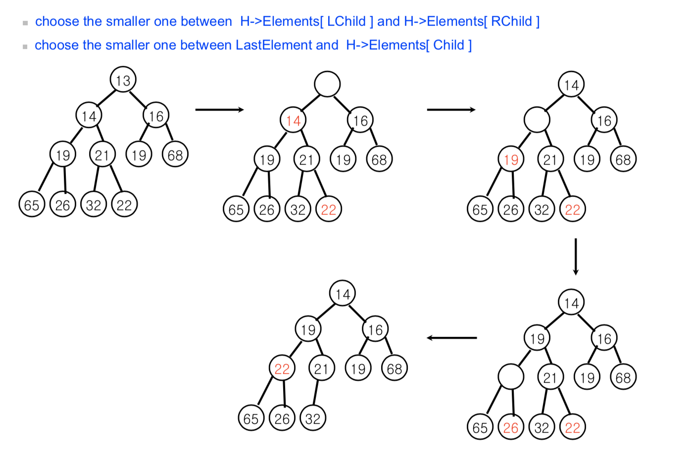

### Heap

---

#### 1.Priority Queue

##### 1-1. definition
- 컴퓨터에서는  우선순위의  개념이  필요할  때가  종종  있다.

- **the element to be deleted is the one with the highest (or lowest) priority**

- 배열,연결리스트  등으로  구현  가능하지만 **heap이 가장 효율적인 자료구조이다.**

##### 1-2. ADT
- priority queue Q supports
	- insert(X, Q)
	- deleteMin(Q)
	- deleteMax(Q)

#### 2. Binary (min) heap
##### : a min heap is a **complete binary** tree and **partially ordered tree**  in which the key value in each node is no larger than the key values in its children

##### 1-1. complete tree

every level of tree is completely filled, with the exception of the bottom level, which is filled from left to right (With height h, there are between 2h and 2h+1 – 1 nodes)

##### 1-2. partially ordered tree

- the key of each internal node is less than of equal to the keys of its children

- the smallest element should be at the root

##### 1-3. implementation
- binary heap can be stored in array since it is complete tree

- insertion

- deletion

#### 3. Heap sort

