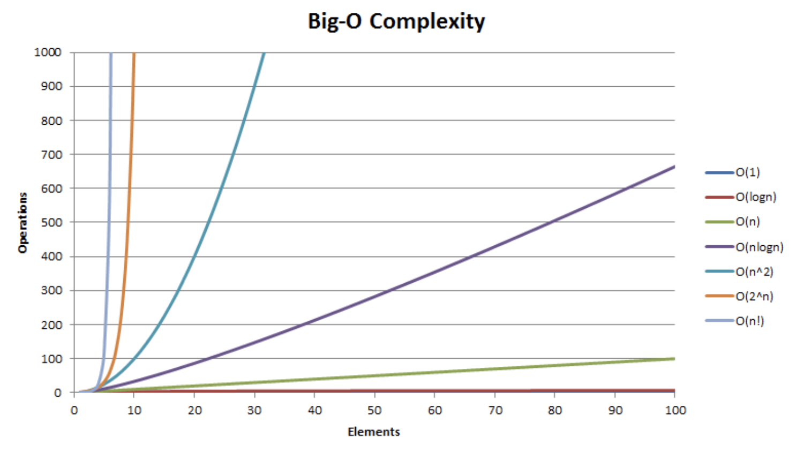

### 1. Data Structure
---
사람들이 사물들을 정리하는 것 처럼 프로그램에서도 자료들을 정리하는 여러가지 구조들이 있다. 이를 자료구조라 부른다.

---
### 2. Algorithm
#### : finite set of instructions that accomplish a particular task
---
컴퓨터로 문제를 풀기위한 단계적인 절차. 컴퓨터가 주어진 상태에서 문제를 해결하는 방법을 정밀하게 컴퓨터 언어로 기술한 것. 

- algorithms satisfy the following criteria
  - zero or more inputs  
  - at least one output  
  - definiteness (clear, unambiguous instructions) 
  - finiteness (terminates after a finite number of steps) 
  - effectiveness

#### 2-1. recursive algorithms
##### : Allow us to express a complex process in very clear terms

- Any function that we can write using assignment, if-else, and while statements can be written recursively
- direct recursion : a function call them selves
- indirect recursion : a function call other function that invoke the calling function again
- should establish **boundary condition** that terminate the recursive call

### 3. Data abstraction
---

### 4. Performance evaluation

#### 4-1. machine dependent performance measurement
#### 4-2. machine independent performance analysis (complexity theory)
##### space complexity : the amount of memory that it needs to run to completion
	- Total space requirement
		- fixed space requirement
			- not depend on the number and size of the program’s inputs and outputs
			- e.g. instruction space, variable space, constant space, structure variable space
		- variable space requirement
			- the space needed by structured variable whose size depends on the particular instance of the problem being solved
			- e.g.stack, dynamic memory allocation

##### time complexity : time taken by a program
	- Total time taken by a program
		- compile tile
		- run time(execution) time : count the number of operations that the program performs 

##### asymptotic notation
- big-O notation : used to describe **the worst case** running time for an algorithm.
	- mathematical notation that describes the limiting behavior of a function  when the argument tends towards a particular value or infinity.
	- f(n) = O(g(n)) iff there exist positive constants c and n0 such that f(n) ≤ c·g(n) for all n, n ≥ n0 
		- g(n) is an **upper bound** on the value of f(n) for all n, n ≥ n0
		- g(n) should be as small a function of n as informative

- big-Ω notation : used to describe **the best case** running time for an algorithm.
	- f(n) = Ω (g(n)) iff there exist positive constants c and n0 such that f(n) ≥ c·g(n) for all n, n ≥ n0
	- g(n) is a **lower bound** on the value of f(n) for all n, n ≥ n0

- big-Θ notation
	- f(n) = Θ(g(n)) iff there exist positive constants c1, c2, and n0 such that c1·g(n) ≤ f(n) ≤ c2·g(n) for all n, n ≥ n0
	- g(n) is **both** an upper and lower bound on f(n)

---

## Ref
[Data structures and Algorithms with thier complexities]([https://www.hackerearth.com/practice/notes/big-o-cheatsheet-series-data-structures-and-algorithms-with-thier-complexities-1/](https://www.hackerearth.com/practice/notes/big-o-cheatsheet-series-data-structures-and-algorithms-with-thier-complexities-1/))
