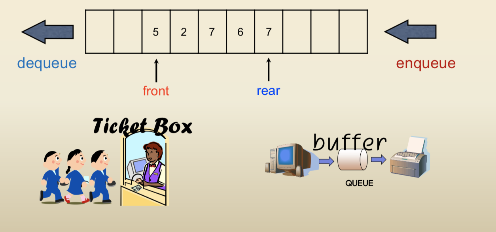

### Queue
##### : a list that insertion is done at one end, whereas deletion is performed at the other end

---

#### 1. Abstract data type

 - enqueue(X) : inserts element  X at the end of the list
 - dequeue(): deletes the element at the start of the list
 - front(head) : index of the removal of existing element takes place
 - rear(tail) : index of an element entered most recently

#### 2. Implementations

- by Array
	- linear queue
	- circular queue
- by Linked-list

#### 3. Use cases
 - job scheduling : in the operating system which does not use priorities, jobs are processed in the order they enter the system
 - Breath-First Search
---
