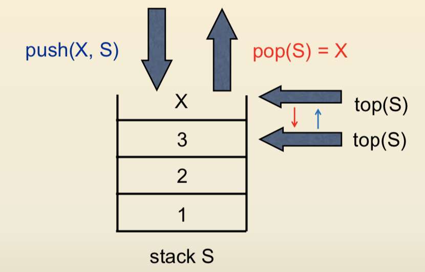
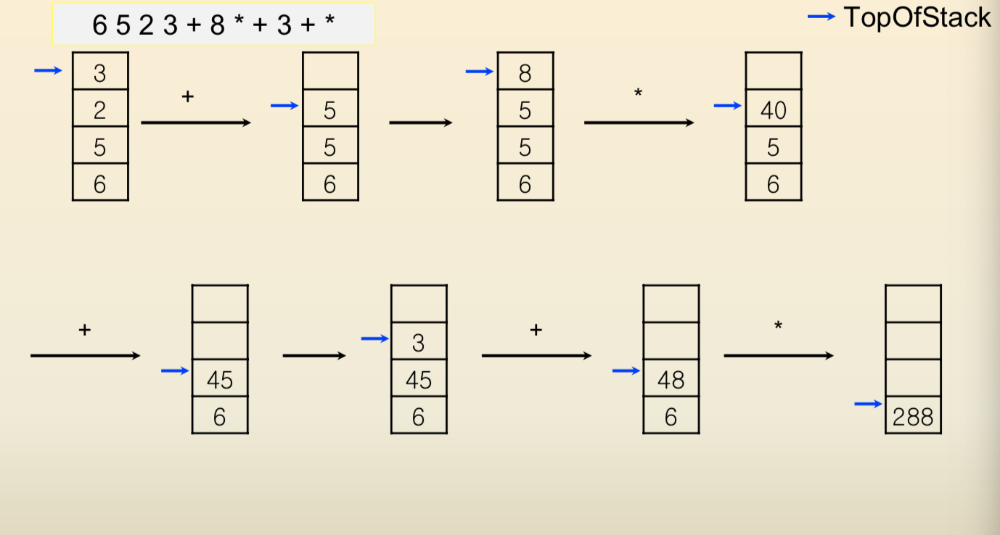
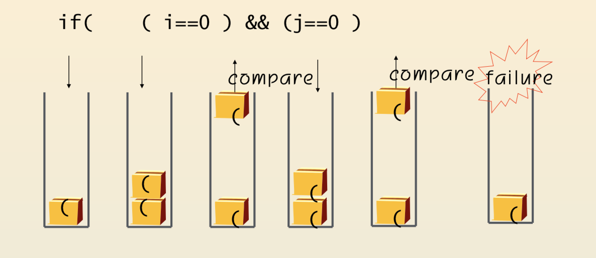
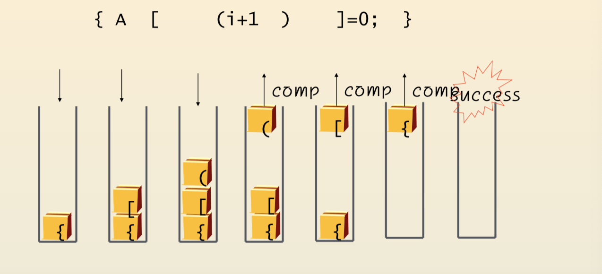

### Stack
##### : a list that insertions and deletions can be performed at the end of the list

##### : -   **LIFO**(Last In First Out).  즉, 자료의  출력  순서가  입력순서의  역순으로  이루어져야  할  경우  매우  긴요하게  쓰인다. 

---

#### 1.Operations

 - push(X,S) : insert element X in the list S
 - pop(S): deletes the most recently inserted element from S

#### 2. Implementations

- by Array
	- 구현이 간단한 반면, 스택의 크기가 고정되는 단점이 있다.
- by Linked-list
	- 구현이 복잡한 반면, 스택의 크기가 가변적이 장점이 있다.

#### 3. Use cases
 - formula calculation 
	- postfix evaluation
		1. scan left to right
		2. place the operands on a stack until an operator is found 
		3. perform operations 

- parenthesis matching problem

