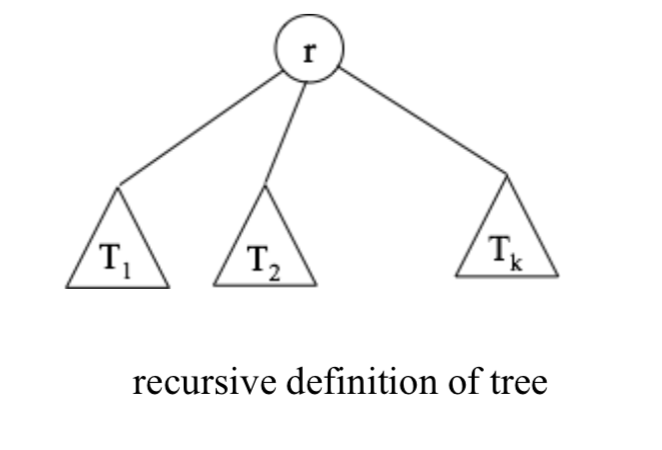

### Tree
##### :  만약  자료들이  계층적인  구조(hierarchical structure)를  가지고있다면, 선형  자료구조는  적절하지  못하다. 트리는 이러한  **계층적인 자료를 표현하는데 이용되는 자료구조** 이다. 이런  계층적인  구조를  트리라고  부르는  이유는  이러한  구조들이  실제  트리를  거꾸로  엎어놓은  듯  한  모양을  하고있기  때문이다.

---

#### 1. Definition

- recursive definition : a distinguished node called root and zero or more sub trees(T1,T2,.....Tk). each of whose roots are connected with r by an edge.

#### 2. Terminology

	- root : the top-most node
	- depth(level) of node : length of the (unique) path from the root to that node.
	- sibling : roots of the subtrees have same parent
	- degree of node : the number of children it has
	- terminal(leaf) node : node of degree 0.

